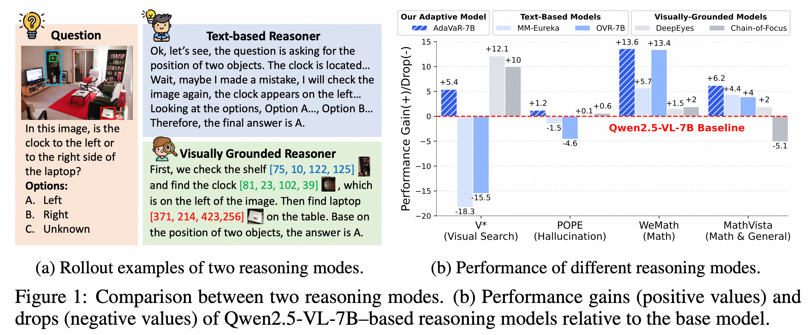
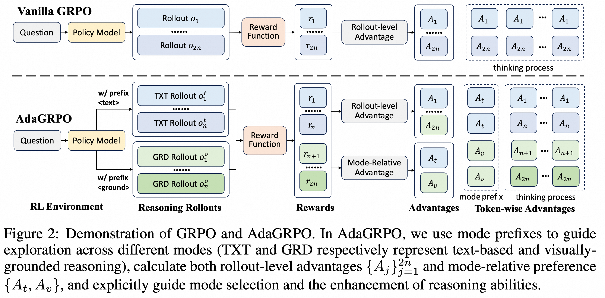
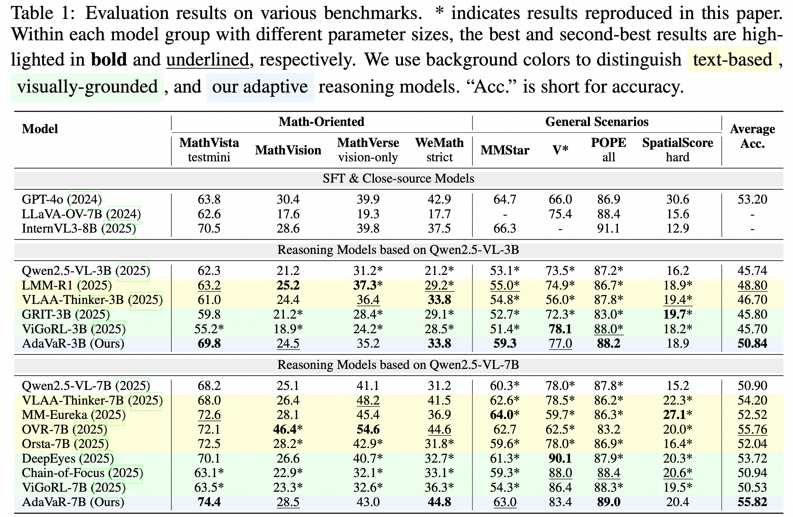

# Mixture-of-Visual-Thoughts

This is the repo for our paper "Mixture-of-Visual-Thoughts: Exploring Context-Adaptive Reasoning Mode Selection for General Visual Reasoning" where we explore a novel visual reasoning paradigm that integrates different **thinking modes** in one unified model and guides it to adaptively select the appropriate one based on the question.


## Introduction

We find that current visual reasoning models mainly rely on one of thinking modes, as shown in Figure 1(a):

1. Text-based reasoning: direct express reasoning with natural languages;
2. Grounded reasoning: align reasoning processes with images with coordinates (typically object bounding boxes)

<p align="center">
    
<p>

Different reasoning modes impose distinct inductive biases, yielding varying strengths and weaknesses across domains, as shown in Figure 1(b):

1. Text-based reasoning is better at abstrat reasoning like mathematics but is more prone to hallucinations (potentially due to overthinking and language bias);
2. Grounded reasoning excels in domains with clear object information, yet show limited gains in math problems (abstract concepts like length, size, etc. cannot be grounded to provide useful information);

To this end, we investiaget a question: "can we integrate the complementary strengths of different modes to build a general visual reasoning model?"

### Core Contributions
- We propose Mixture-of-Visual-Thoughts, a novel reasoning paradigm, we validate that: with a well-designed training framework, a model can (1)integrate different thinking modes and (2) adaptively select appropriate modes based on questions.
- We introduce AdaVaR, a two-stage training framework: an SFT cold-start stage to learn differen thinking modes, and an RL stage to induce adaptive mode selection abilities with the proposed AdaGRPO algorithm.

<p align="center">
    
<p>

- Experimental results demonstrate the effectiveness of AdaVaR:
<p align="center">
    
<p>

1. Our AdaVaR-3B and AdaVaR-7B combine the strengths of two modes and are the **only models** that outperform Qwen2.5-VL baseline across all datases;
2. In terms of the overall average accuracy, AdaVaR achieves the best results in both the 3B and 7B groups. Notably, AdaVaR-3B reaches a level very close to Qwen2.5-VL-7B, while AdaVaR-7B surpasses GPT-4o.

## Installation
Since the packages required for SFT and RL differ slightly, we manage them with two seperate environments:
```bash
# for sft and evaluation
conda create -n movt-sft python=3.10
conda activate movt-sft
pip3 install -r requirements_sft.txt
# for rl
conda create -n movt-rl python=3.10
conda activate movt-rl
pip3 install -r requirements_rl.txt
```

## Quick Usage of AdaVaR
Our AdaVaR-3B/7B models are based on Qwen2.5-VL-3B/7B, you can use them the same way as Qwen2.5-VL--just modify the system_prompt and supplement a post prompt.
```python
from transformers import Qwen2_5_VLForConditionalGeneration, AutoProcessor
from constants import R1_SYSTEM_PROMPT_ADAPT_v2, POST_PROMPT_ADAPT_v2
import torch
from qwen_vl_utils import process_vision_info

# loading the model and processor
model_path = "your_name/AdaVaR-3B"
device = torch.device("cuda")
model = Qwen2_5_VLForConditionalGeneration.from_pretrained(model_path, torch_dtype=torch.bfloat16, device_map=device)
processor = AutoProcessor.from_pretrained(model_path)

# construct input messages
image = "./assets/vstar.jpg"
query = "Is the dog on the left or right side of the bicycle? (A) right; (B) left. Please answer the question with the correct option letter, e.g., A, B, C, D."

messages = [
    {"role": "system", "content": R1_SYSTEM_PROMPT_ADAPT_v2},
    {
        "role": "user",
        "content": [
            {
                "type": "image",
                "image": image,
            },
            {"type": "text", "text": query + " " + POST_PROMPT_ADAPT_v2},
        ],
    }
]

# process model inputs
image_inputs, _ = process_vision_info(messages)
query = processor.apply_chat_template(messages, tokenize=False, add_generation_prompt=True)
input_dict = {k:v.to(device) for k,v in processor(text=[query], images=image_inputs, padding=True, return_tensors="pt").items()}

# generate model responses
output = model.generate(**input_dict, use_cache=True, do_sample=False, max_new_tokens=2048)
output_trimmed = [
    out_ids[len(in_ids) :] for in_ids, out_ids in zip(input_dict['input_ids'], output)]
response = processor.tokenizer.batch_decode(output_trimmed)[0]
print(response)
```

AdaVaR will adaptively choose an appropriate mode. Users can specify the mode by fixing the mode prefix token:
```python
# query for using visually-grounded mode
grd_query = processor.apply_chat_template(messages, tokenize=False, add_generation_prompt=True) + "<grounding>"

# query for using text-based mode
txt_query = processor.apply_chat_template(messages, tokenize=False, add_generation_prompt=True) + "<text>"
```

## Training

### Data Preparation
1. download data from huggingface (use hf-mirror if you cannot access huggingface)
    ```bash
    # use hf-mirror if needed
    export HF_ENDPOINT=https://hf-mirror.com
    huggingface-cli download --repo-type dataset --resume-download your_name/MoVT-Train --local-dir MoVT-Train --local-dir-use-symlinks False
    # unzip images
    cd MoVT-Train
    cat SFT/sft_images_* > sft_images.zip
    unzip SFT/sft_images.zip -d SFT/
    unzip RL/rl_images.zip -d RL/
    ```
2. modify the path in config files, e.g., the [sft data configs](./config/datasets/sft/) and the [rl data configs](./config/datasets/rl/).

### SFT

1. Set the corresponding model load and save paths in the [training scripts](./scripts/SFT/).
2. Conduct training with the parameter setup in the scripts:
```bash
# SFT on 3B models
bash scripts/SFT/sft_3b.sh

# SFT on 7B models
bash scripts/SFT/sft_7b.sh
```

### RL
Our RL training framework is based on open-r1-multimodal:

1. Set the model load and save paths in [RL scripts](./scripts/RL/).
    - The 3B and 7B experiments are based on the same script template, modify it as needed; 

2. Running the training scripts, where we e provide two training scripts:
    1. Naive method by generating rollouts with Huggingface `generate` methods:
        ```bash
        # bianry mix phase
        bash scripts/RL/rl_binary_mixture.sh
        # diverse mix phase
        bash scripts/RL/rl_diverse_mixture.sh
        ```

    2. Accelerating rollout generation with vllm:
        - However, the current framework only supports vLLM v0 engine, we recommend to use `vllm==0.7.3` for training:
        ```bash
        # bianry mix phase
        bash scripts/RL/rl_binary_mixture_vllm.sh
        # diverse mix phase
        bash scripts/RL/rl_diverse_mixture_vllm.sh
        ```

Current implementation is for single-node environment, which can be utilized to reproduce our experiments. Users can use different frameworks to adapt it to multi-node training to improve efficiency.

## Evaluation
For evaluation, please follow: 

1. We provide a collection of the used evaluation datasets, users can directly download them:
    ```bash
    # download the data
    huggingface-cli download --repo-type dataset --resume-download your_name/MoVT-Eval --local-dir MoVT-Eval --local-dir-use-symlinks False
    # unzip the data
    cd MoVT-Eval
    cat MoVT-Eval-part_* > MoVT-Eval.zip
    unzip MoVT-Eval.zip
    ```
Please notice that we do not present new datasets, the evaluation data comes from existing datasets, please use them in accordance with the requirements of the original dataset sources.


2. Modify [dataset configs](./config/datasets/eval/) with the path to the downloaded data.

3. You can run inference across all datasets with the provided script:
    ```bash
    conda activate movt-sft # use the sft environment
    export PATH_TO_MODEL="your_name/AdaVaR-3B" # path to the trained models
    export MODEL_STORE_NAME="adavar-3b" # the name used to store your inference results
    export PATH_TO_BASE_MODEL="Qwen2.5-VL-3B" # path to the base Qwen2.5-VL model
    bash scripts/eval/inference_dynamic.sh "0,1,2,3,4,5,6,7" ${PATH_TO_MODEL} ${MODEL_STORE_NAME} plain system_adapt_v2 qwen25  ${PATH_TO_BASE_MODEL}  "--vllm" 4096 "mathverse,wemath,mathvista,mathvision,vstar,mmstar,pope,spatialscore"
    ```
where `--vllm` is optional and for acceleration with vllm.

4. Evaluate the corresponding metrics with the rule-based tools, for example, for MathVista:
    ```bash
    python3 -m eval.eval_tools.mathvista --result ./output/math/${MODEL_STORE_NAME}/math/MathVista.json --path /PATH/TO/MoVT-Eval/MathVista/
    ```
Evaluation on other datasets is similar.

## Acknowledgement
Our implementation is partially based on the following codebases: [open-r1-multimodal](https://github.com/EvolvingLMMs-Lab/open-r1-multimodal), [R1-Multimodal-Journey](https://github.com/FanqingM/R1-Multimodal-Journey), [Orsta](https://github.com/MiniMax-AI/One-RL-to-See-Them-All), [Qwen2.5-VL](https://github.com/QwenLM/Qwen3-VL), and [VoCoT](https://github.com/RupertLuo/VoCoT). 

We sincerely thank them for the open-source contributions.
